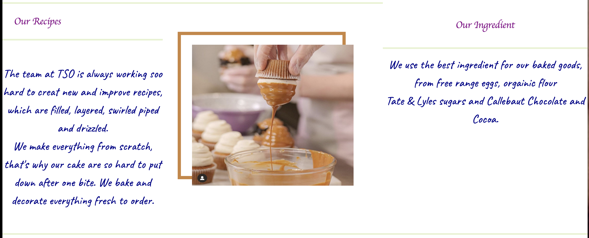
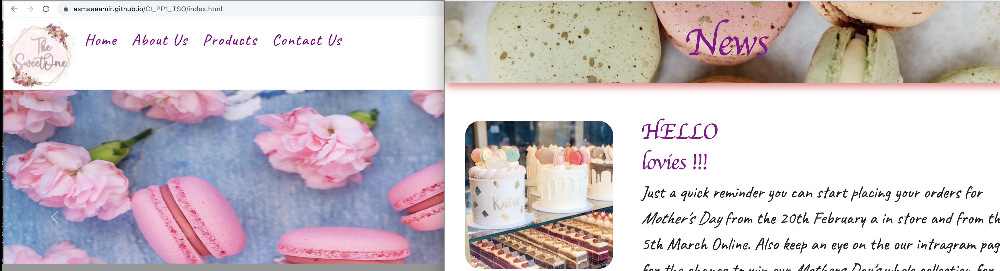

# The Sweet One 
(Developer : Asma Aamir)

[Live Webpage](https://asmaaaamir.github.io/CI_PP1_TSO/)

1. [Project Goals](#projects-goals)
    1. [User Goals](#user-goals)
    2. [Site Owner Goals](#site-owner-goals)
2. [User Experience](#user-experiencer)
    1. [Target Audience](#target-audience)
    2. [User Requrements and Expectations](#users-requirment-and-expectations)
    3. [User Stories](#user-stories)
3. [Design](#design)
    1. [Design Choices](#design-choice)
    2. [Colour](#colour)
    3. [Fonts](#fonts)
    4. [Structure](#strucure)
    5. [Wireframes](#wireframes)
4. [Technologies Used](#technologies-used)
    1. [Languages](#languages)
    2. [Frameworks & Tools](#frameworks--tools)
5. [Features](#features)
6. [Testing](#validation)
    1. [HTML Validation](#html-validation)
    2. [CSS Validation](#css-validation)
    3. [Accessibility](#accessiblity)
    4. [Performance](#performance)
    5. [Device testing](#performing-tests-on-various-devices)
    6. [Browser compatibility](#browser-compatabilty)
    7. [Testing user stories](#test-users-stories)
8. [Bugs](#bugs)
9. [Deployment](#deployment)
10. [Credits](#credits)
11. [Acknowledgements](#acknowledgements)

## Projects Goals
### User Goals:
* Find a bakery that offer cake of all kind of events. 
* Find out what flavours of Cupcake and Brownies are baked daily.
* Find the location of the bakery

### Site Owner Goals:
* Boots business reputation and sales
* Provide informtion about the business to new to returning users 
* Giving user the accessbity to have a look what business has to offer them at ther own time 
* providng userto stay on conatct with the business different ways.

## User Experiencer

#### Target Audience
* Users looking to hire someone to bake their Wedding Cake or birthday cake.
* User looking for last minute Cakes for birthday, some leave work or even a surprise.
* Walk in user having the option to chose cupcake, brownies and Cakes takeaway with them. 

### Users Requirment and Expectations
* Good presentation and a visually appealing design   
* A simple and easy navigation system, where the user can easily find relevant information
* The content is efficient and accessible 
* Links and funcation that work as expected 

### User Stories 

### First-time User:
1. As first-time user, I want to know where I can find store contact number.
2. As first-time user, I want to know how to find the store address.
3. As first-time user, I would like to do a cake test for my wedding before I place my order.
4. As first-time user, I want to know what kind on ingredient bakry uses.

### Returning User:
1. As a returning user, I want to know where I could find daily freshly bakes flavours of cupcake and brownies. 
2. As a returning user, I would like to alter my birthday cake order where do I do. 
3. As a returning user, I want to know where can I find infromation about current or upcoming competition.
4. As a returning user, I want to when can I place Mother's Day cake order.

## Design 

### Design choice
The webpage was designed with keeping the store and the logo in vision, giving its user experience of colour, happiness and comfort. 
### Colour
When choosing the colour scheme, I kept the colourful cakes and happiness one feel when they are eatting a cake. Also keeping the logo in mind, I went for pink and light colours. 
### Fonts
When deciding on the font I kept the logo in mind and how the cake gives a smooth finsih. So, I chose dancing script for my heading matching my logo and caveat so it's easy-to-read the content. 
### Strucure
Upon arriving on the website, the user sees the logo with navigation bar which takes them to any of the pages they would like. However if the user wanted to go back to home pagethey could just click the logo on any page and  would take the user back to home page. 
The website consists of four pages:
- A home page - that has two section one for Daily Flavours and second section is for News about the bakery. 
- A about page - that tells user about the bakery, the ingredient the bakery uses and how everything is freshly  made every day. 
- A product page - that gives you option to choose from products cakes, wedding Cakes, Cupcakes and Brownies.
- A contact us page - that has a form allowing user to send bakery a message or enquiry, information on how contact store and a Map to find the bakery. 
 
Basicly the structue of the website is simple easy to learn your way and find what the user is looking for. 

### Wireframes

 
Home

 
About Us

 
Products

 
Contact Us

## Technologies Used 

### Languages 
* HTML 
* CSS

### Frameworks & Tools
* GitHub 
* GitPod
* Balsamiq
* Google Font
* Font Awsome
* Pexels
* Tinypng
* Favicon.io 
        
## Features
   
### Logo & Navigation Bar
The logo and the navbar is featured on all four pages and is fully responsive thus, the  navbar does chaneg in to a toggler (humburger) on a smaller screen. which inculdes links to all four pages. The logo on the left of the page is a link to home page is well, this allows the user to get back to home page quickly and effiently. 

### Carousel
When the user open the webpage they are welcomed with a 4 slide show, thats gives them the option for them to navigate to the next slide or to previous slide. 

    
### Daily Flavour's
Allowes the user to have a look what flavours that are avalibale for cupcakes and brownies.  
User story covered: 4 

      
### News
Allowes the users to see upcoming events order deadlines and if we have any ongoing or coming competition, whihc alows them to enter and win a price.  
User story covered: 7 

### Footer
The Footer is featured on all four pages and it contain contact information and soical media links.  
User stories covered : 1 and 5

### About Us 
This pages consistes of three section the first section gives a description on what we doa dn where we are located with a image of the front on the counter as you enter the store. 

Second section tell you is a video, thats mute and on loop showing you cake mixture being mixed. 

Thired section has sominformtipn about our recipies and ingrenetd with a image between.  
User story: 6

### Products: 
On this page users are able to see four section and Each section has four different flavour of that specific item and some information about what it contain's.  
User stories: 2 and 3.  
The four section are:

- Cakes 

- Wedding Cakes 

- Cupcake Flavours

- Brownies

### Contact Form 
User can use the fomr to conatc the store to palce orders or araneg ameetig for wedding cakes.  
User stories: 2 and 3. 
        
### Contact details 
Provides the user with store locoation information and contact details.  
User story: 1. 
        
### Map 
Shows the user where the store is locoated on embeded Googel Map.  
User story: 5

## Testing 

### Validation 

#### HTML Validation
I used the W3C Markup Validation Service to validate the HTML of this website. All pages pass with no errors and no warning were shown. 

 
Home

 
About Us 

 
Products 

 
Contact Us

#### CSS Validation
I used the W3C Jigsaw CSS Valdation Service to validate the CSS of this website and it all passed. 
style.CSS 

#### Accessiblity 

 
Home

 
About Us 

 
Products 

Contact Us

#### Performance 
To test perpormace of the website Google Lighthouse in Google Developer Tools was used.

 
Home

 
About Us 

 
Products 

 
Contact Us

#### Performing tests on various devices 
* Mac
* iPad
* iPhone 13 Max 
        
In addition, to above devises I have also tested using Google Chrome Developer Tool Device Toggeling option for the most populer devices that are currenty available on the market. 

#### Browser Compatabilty 
I have tested the website on few different browser such as:
* Google Chrome
* Safari 
* Microsoft Egde

#### Test users stories
1. As first-time user, I want to know where I can find store contact number

| Feature | Action | Expected Result |  Result | 
|---------|------- | ----------------|---------|
|The Footer has contact information or user can go to Contact Us page| On any of the pages user can scroll down and find the footer. Also on top any page the Navbar has contact page link| Find the contact number| Works as expected| 
 
 
Story 1

2. As first-time user, I want to know how to find the store address.

| Feature | Action | Expected Result | Result | 
|---------|------- | ----------------|--------|
|The Footer has address information or user can go to Contact Us page| On any of the pages user can scroll down and find the address. Also on top any page the Navbar has contact page link| User shoudl be able to find the address | Works as expected| 
|Map | Go to Navigation bar and click on contact us, scroll down to the bottom | Map will show the location of the bakery| workes as expected|
 
 
Story 2

3. As first-time user, I would like to do  a cake test for my wedding before I place my order.

| Feature | Action | Expected Result | Result | 
|---------|------- | ----------------|--------|
|Form| Go to Navigation bar and click on contact us scroll down to form and fill in our detail someone from bakery will contact you| user shoudl be able to find the form and fill it | works as expected|
 
 
Story 3

4. As first-time user, I want to know what kind on ingredient bakery uses.

| Feature | Action |  Expected Result| Result | 
|---------|------- | ----------------|--------|
|About Us page| Go to Navigation bar and click on About Us page and scroll down| User should be able to see Our ingredient section| works as expected|

 
Story 4

### Returning User:
5. As a returning user, I want to know where I could find daily freshly bakes flavours of cupcake and brownies. 

| Feature | Action |  Expected Result| Result | 
|---------|------- | ----------------|--------|
|Daily Flavour| On home page if user scrolls down | User should be able to see Daily Flavour's section| works as expected|

 
Story 5

6. As a returning user, I would like to alter my birthday cake order where do I do. 

| Feature | Action |  Expected Result| Result | 
|---------|------- | ----------------|--------|
|Form| Go to Navigation bar and click on contact us scroll down to form and fill in our detail someone from bakery will contact you| user shoudl be able to find the form and fill it | works as expected|
|The Footer has contact information or user can go to Contact Us page| On any of the pages user can scroll down and find the footer. Also on top any page the Navbar has contact page link| Find the contact number| Works as expected|  

 
Story 6

7. As a returning user, I want to know where can I find information about current or upcoming competition.

| Feature | Action |  Expected Result| Result | 
|---------|------- | ----------------|--------|
|News| On home page scroll down to the News section| User should be able to see News section where it should state about competition| works as expected|

 
Story 7

8. As a returning user, I want to when can I place Mothers Day cake order

| Feature | Action |  Expected Result| Result | 
|---------|------- | ----------------|--------|
|News| On home page scroll down to the News section| User should be able to see News section when to place a order for Morthers Day | works as expected|

 
Story 8

### Bugs

|** Bug ** | ** Fix ** |
|-----        |  ----------- |
|On smaller screen the toggle was moved to left handside | In style sheet added !important to justify-content|
|Carousle next and previouse button were taking all the space on home page | In styles sheet add the percentage and transform. |
|The products images were over flowing out of card on smaller screen| Fixed the issue with setting up width and height on smaller screen|

## Deployment
I followed the below steps to deploye this website using GitHub pages :
1. Go to GitHub repository navigation then setting
2. On the left hand side, you see Pages 
3. Then on the middel of the page you see Source: there you will see branch and select Main
4. The select folder to be root and the save 
5. It will take couple of mintues after refreshing your page you should see a light green ribbon on the top saying "Your site is published at https://asmaaaamir.github.io/CI_PP1_TSO/". 

## Credits

### Code
The HTML code for Navigation Bar [https://getbootstrap.com/docs/5.0/components/navbar/] was taken from Bootstrap v5.0. I did remove the search option from it and removed the colour in the background,The Carousel code was taken from Bootstrap is well [https://getbootstrap.com/docs/5.0/components/carousel/#with-indicators]. But i did add one more slide to the carsouel 
### Media 
The images and video are from two different website below I will tell in appearance of order;
* Home Page
    - All the four images in the carousle are from <a href ="https://www.pexels.com/search/image/">Pexels </a>.
        <a href="https://www.pexels.com/photopink-macaroons-placed-among-carnations-on-table-7474293">Image 1 </a>
        <a href="https://www.pexels.com/photo/cupcakes-on-wooden-tray-near-sweets-and-macaroons-with-blueberries-7525120/"> Image 2 </a>
        <a href="https://www.pexels.com/photo/crop-woman-with-tasty-macaroons-7525146/"> Image 3</a>
        <a href="https://www.pexels.com/photo/lady-standing-in-cafeteria-and-demonstrating-sign-open-6205480/">Image 4 </a>
    - Image in background for daily flavour and News is from <a href="https://www.instagram.com/annacakecouture/">Annacakecouture </a>. Also the images in these section are from there.
* About Page 
    - Caked on display in a shop image is from <a href="https://www.instagram.com/annacakecouture/">Annacakecouture </a>
    - The video is from  <a href="https://www.pexels.com/video/stirring-flour-and-condensed-milk-in-a-mixing-bowl-3325984/"> Pexels</a>
    - The last image on this page is from <a href="https://www.instagram.com/crumbsanddoilies/">Crumbs and Doilies</a>.
* Product Page
    - The Cake, Wedding Cake and Cupcake section images are from  <a href="https://www.instagram.com/annacakecouture/"> Annacakecoutre</a>. 
    - The Brownines images are from <a href="https://www.instagram.com/crumbsanddoilies/"> Crumbs and Doilies</a>.
   
### Acknowledgements 
I would like to take this opportunit to thank :
- My mentor Mo Shami for his feedback , advise and guidance
- The two tutor who helped me solved two issue Alex and James.
- My mum Farida Liaqat for looking after my daughter and my daughter Zainab Rana for being very patient with me while I sit on computer all day. 
